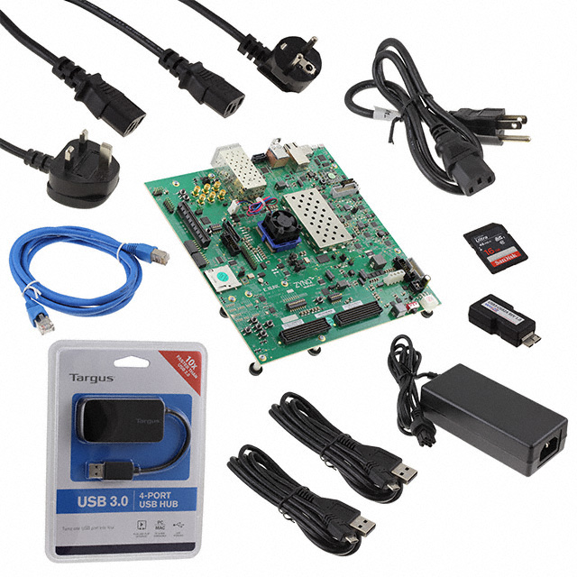

# ZCU102 USB Gadget & NVMe Platform

<p align="center">
  
</p>

<p align="center">
  <b>Multi-function USB Gadget · PCIe NVMe · Web Server · Browser Terminal</b>
</p>

<p align="center">
  <a href="#features">Features</a> •
  <a href="#architecture">Architecture</a> •
  <a href="#quick-start">Quick Start</a> •
  <a href="#scripts">Scripts</a> •
  <a href="#web-server">Web Server</a> •
  <a href="#documentation">Documentation</a>
</p>

---

## Overview

This project transforms the **Xilinx ZCU102** evaluation board (Zynq UltraScale+ MPSoC) into a multi-function USB device platform. A single USB cable connection provides simultaneous Ethernet networking, mass storage, and serial console access to a host PC. The system also hosts a showcase web server with a live interactive browser terminal.

**Author:** Ali Mehrpooya  
**Affiliation:** Smart Internet Lab (HPN Group), University of Bristol  
**Platform:** PetaLinux 2024.1, Linux 6.6.10-xilinx  
**Board:** ZCU102 Rev 1.0 (XCZU9EG-2FFVB1156E)

---

## Features

### USB Gadget Functions (One Cable → Three Devices)
| Function | Host Sees | Board Device | Protocol |
|----------|-----------|-------------|----------|
| **Ethernet** | USB NIC adapter | `usb0` at 192.168.10.20 | RNDIS |
| **Mass Storage** | USB flash drive (931.5 GB) | `/dev/nvme0n1p2` | USB MSC |
| **Serial Console** | COM port | `/dev/ttyGS0` | CDC ACM |

### Storage & Networking
- **NVMe SSD:** 931.5 GB MAXIO MAP1202 via PCIe (x1 or x4)
- **Samba File Server:** Simultaneous NVMe access from board and Windows
- **HTTP File Browser:** Zero-dependency NVMe browsing in the browser

### Web Interface
- **Showcase Page:** Dark circuit-board aesthetic with live JS demos
- **Browser Terminal:** Full PTY shell via xterm.js + WebSocket (hot-pink theme)

### Hardware Configurations
| Configuration | GTR Lanes | USB Speed | PCIe |
|--------------|-----------|-----------|------|
| PCIe x4 | All 4 → PCIe | USB 2.0 (480 Mbps) | x4 Gen2 |
| Normal | PCIe+DP+SATA+USB3 | USB 3.0 (5 Gbps) | x1 Gen2 |

---

## Architecture

```
┌─────────────────────────────────────────────────────┐
│                    HOST PC (Windows)                  │
│                                                       │
│  NIC adapter ─── Samba/HTTP/SSH/Web Terminal           │
│  USB Drive ───── 931.5 GB NVMe or ONDM file share    │
│  COM Port ────── PuTTY 115200 8N1 → Board shell      │
└──────────────────────┬──────────────────────────────┘
                       │ USB Cable (single)
┌──────────────────────┴──────────────────────────────┐
│              ZCU102 (Zynq UltraScale+ MPSoC)         │
│                                                       │
│  ┌──────────┐  ┌──────────┐  ┌──────────┐           │
│  │  RNDIS   │  │   Mass   │  │  CDC ACM │           │
│  │ Ethernet │  │ Storage  │  │  Serial  │           │
│  └────┬─────┘  └────┬─────┘  └────┬─────┘           │
│       │              │              │                 │
│       └──────────────┼──────────────┘                 │
│              configfs composite gadget                │
│                      │                                │
│              ┌───────┴───────┐                        │
│              │ DWC3 UDC      │                        │
│              │ fe200000.usb  │                        │
│              └───────┬───────┘                        │
│                      │                                │
│  ┌───────────────────┼──────────────────────────┐    │
│  │ PS-GTR SerDes     │                          │    │
│  │ Lane 0: PCIe ─── NVMe SSD (931.5 GB)        │    │
│  │ Lane 1: DP ───── DisplayPort Monitor          │    │
│  │ Lane 2: USB3 ─── USB 3.0 SuperSpeed           │    │
│  │ Lane 3: SATA ─── (available)                  │    │
│  └──────────────────────────────────────────────┘    │
└──────────────────────────────────────────────────────┘
```

---

## Repository Structure

```
.
├── README.md                          # This file
├── docs/
│   ├── ZCU102_USB_Gadget_Tutorial.md  # Comprehensive engineering tutorial
│   └── chat_migration_summary.md      # Context for continuing development
├── scripts/
│   ├── usb-gadgets/                   # USB gadget start/stop scripts
│   │   ├── ethernet_usb_start.sh
│   │   ├── ethernet_usb_stop.sh
│   │   ├── ethernet_usb_change_ip.sh
│   │   ├── nvme_usb_start.sh
│   │   ├── nvme_usb_stop.sh
│   │   ├── serial_usb_start.sh
│   │   ├── serial_usb_stop.sh
│   │   ├── serial_terminal.sh
│   │   ├── serial_raw_send.sh
│   │   ├── serial_raw_receive.sh
│   │   ├── combined_usb_start.sh
│   │   ├── combined_usb_stop.sh
│   │   ├── triple_usb_start.sh
│   │   ├── triple_usb_stop.sh
│   │   ├── ondm_usb_start.sh
│   │   ├── ondm_usb_stop.sh
│   │   ├── ondm_triple_start.sh
│   │   └── ondm_triple_stop.sh
│   └── services/                      # Services that run over USB Ethernet
│       ├── nvme_samba_start.sh
│       ├── nvme_samba_stop.sh
│       ├── nvme_http_start.sh
│       ├── nvme_http_stop.sh
│       ├── over_eth_nvme_samba_start.sh
│       ├── over_eth_nvme_samba_stop.sh
│       ├── over_eth_nvme_http_start.sh
│       ├── over_eth_nvme_http_stop.sh
│       ├── over_eth_web_start.sh
│       └── over_eth_web_stop.sh
├── webserver/
│   ├── www/                           # Showcase web page (port 8080)
│   │   ├── index.html
│   │   ├── style.css
│   │   ├── app.js
│   │   ├── board.jpg
│   │   ├── board-contents.jpg
│   │   ├── web_server_start.sh
│   │   └── web_server_stop.sh
│   └── terminal/                      # Web page + browser terminal (port 8081)
│       ├── index.html
│       ├── style.css
│       ├── app.js
│       ├── terminal.js
│       ├── terminal_server.py
│       ├── start_all.sh
│       ├── stop_all.sh
│       ├── board.jpg
│       └── board-contents.jpg
├── petalinux/
│   ├── device-tree/
│   │   ├── system-user.dtsi           # PCIe x4 + USB2 gadget version
│   │   └── system-user-normal.dtsi    # Normal lanes + USB3 gadget version
│   ├── kernel/
│   │   └── bsp.cfg                    # Kernel config fragment
│   └── rootfs/
│       ├── user-rootfsconfig           # Package declarations
│       └── recipes/                    # Yocto recipes for rootfs integration
│           ├── zcu102-usb-gadgets.bb
│           └── zcu102-webserver.bb
├── images/
│   ├── board.jpg
│   └── board-contents.jpg
└── LICENSE
```

---

## Quick Start

### Prerequisites
- ZCU102 board with PetaLinux 2024.1 booted from SD card
- NVMe SSD installed in M.2 slot (optional, for storage features)
- USB cable connecting ZCU102 USB port to host PC
- Windows: RNDIS driver installed (see tutorial)

### 1. Copy scripts to the board

```bash
scp -r scripts/ petalinux@192.168.137.68:/home/petalinux/
scp -r webserver/ petalinux@192.168.137.68:/home/petalinux/
```

### 2. Start USB Ethernet (simplest gadget)

```bash
sudo ./ethernet_usb_start.sh
# Set Windows RNDIS adapter IP to 192.168.10.1/24
ping 192.168.10.20    # from Windows — verify connectivity
```

### 3. Start Triple Gadget (Ethernet + NVMe + Serial)

```bash
sudo ./triple_usb_start.sh
# Windows sees: NIC + 931.5GB drive + COM port
```

### 4. Start Web Server with Browser Terminal

```bash
sudo ./over_eth_web_start.sh
# Open: http://192.168.10.20:8081
# Scroll to Terminal → Click CONNECT → Full shell in browser
```

---

## Scripts

### USB Gadget Scripts

| Script | Function | Host Sees |
|--------|----------|-----------|
| `ethernet_usb_start/stop.sh` | RNDIS Ethernet only | NIC adapter |
| `nvme_usb_start/stop.sh` | NVMe mass storage only | 931.5 GB drive |
| `ondm_usb_start/stop.sh` | ONDM ZIP as FAT32 image | 1 GB read-only drive |
| `serial_usb_start/stop.sh` | CDC ACM serial only | COM port |
| `combined_usb_start/stop.sh` | Ethernet + NVMe | NIC + drive |
| `triple_usb_start/stop.sh` | Ethernet + NVMe + Serial | NIC + drive + COM |
| `ondm_triple_start/stop.sh` | Ethernet + ONDM + Serial | NIC + 1GB drive + COM |

### Service Scripts (Run Over USB Ethernet)

| Script | Port | Protocol | Access From Host |
|--------|------|----------|-----------------|
| `nvme_samba_start/stop.sh` | 445 | SMB | `\\192.168.10.20\NVMe` |
| `nvme_http_start/stop.sh` | 8080 | HTTP | `http://192.168.10.20:8080` |
| `over_eth_web_start/stop.sh` | 8081+8765 | HTTP+WS | `http://192.168.10.20:8081` |

### Typical Workflow

```bash
# Start the infrastructure
sudo ./ondm_triple_start.sh          # USB gadgets up

# Run a service over ethernet
sudo ./over_eth_nvme_samba_start.sh   # Samba file share

# Or run the web terminal
sudo ./over_eth_web_start.sh          # Web + browser terminal

# Stop in reverse order
sudo ./over_eth_web_stop.sh
sudo ./ondm_triple_stop.sh
# Unplug USB cable
```

---

## Web Server

### Showcase Page (`www/`)

Dark circuit-board aesthetic with amber/teal accents. Features: live uptime counter, hardware specs, board gallery, 6 JavaScript demos (clock, canvas particles, Web Audio, localStorage, DOM animation, fetch API).

### Browser Terminal (`terminal/`)

Same showcase page plus a live interactive terminal powered by xterm.js and a Python WebSocket PTY server. Hot-pink neon aesthetic with CRT scanlines, glowing border, and chrome bar.

**Architecture:**
```
Browser (xterm.js) ←WebSocket→ terminal_server.py ←PTY→ /bin/sh
```

---

## PetaLinux Configuration

### Device Tree (`system-user.dtsi`)

**Normal lane allocation (USB3 SuperSpeed):**
```dts
/include/ "system-conf.dtsi"
#include "zcu102-rev1.0.dtsi"
/ { chosen { myname = "Ali Mehrpooya"; }; };
&gem3 { local-mac-address = [02 00 00 00 00 01]; };
&dwc3_0 { dr_mode = "peripheral"; };
```

### Kernel Config (`bsp.cfg`)

Key additions for USB gadget support:
```
CONFIG_USB_GADGET=y
CONFIG_USB_DWC3_DUAL_ROLE=y
CONFIG_USB_LIBCOMPOSITE=m
CONFIG_USB_CONFIGFS_RNDIS=y
CONFIG_USB_CONFIGFS_ACM=y
CONFIG_USB_CONFIGFS_MASS_STORAGE=y
CONFIG_USB_F_RNDIS=m
CONFIG_USB_F_ACM=m
CONFIG_USB_F_MASS_STORAGE=m
```

---

## Documentation

- **[Full Tutorial](docs/ZCU102_USB_Gadget_Tutorial.md):** Comprehensive engineering tutorial covering all topics
- **[Migration Summary](docs/chat_migration_summary.md):** Context for continuing development in new sessions

---

## Key Lessons Learned

1. **FSBL programs GTR muxes**, not U-Boot or Linux
2. **PCIe x4 requires deleting USB3/SATA/DP psgtr references** to prevent lane stealing
3. **configfs lun flags must be set BEFORE writing file path** (kernel locks after)
4. **RNDIS must be interface 0** in composite gadgets for Windows
5. **UDC state register is unreliable on ZynqMP** — use `function` file instead
6. **xterm.js `onData` must register ONCE** — stacking causes doubled characters
7. **Stop scripts must release resources before rmdir** or they hang forever
8. **Windows university machines block guest SMB** — use user authentication

---

## License

MIT License

---

## Acknowledgments

- AMD/Xilinx for the ZCU102 platform and PetaLinux tools
- Smart Internet Lab, University of Bristol
- xterm.js project for the browser terminal library
